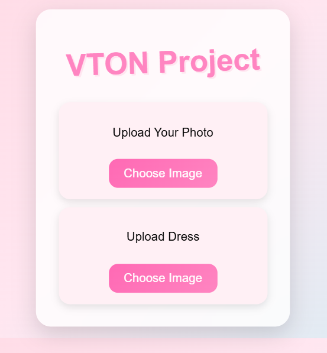
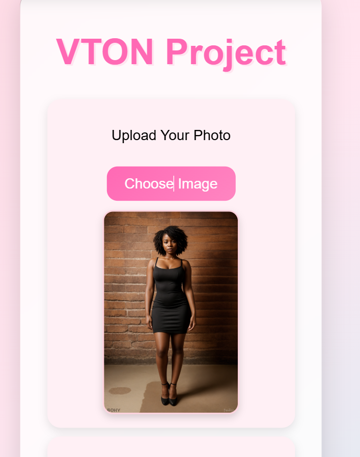
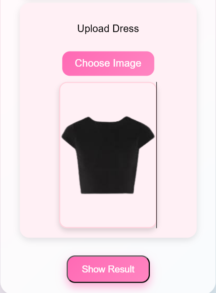
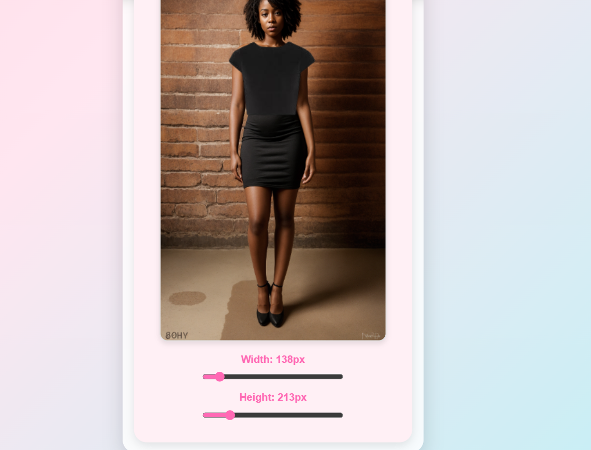

# Virtual Try-On App (VTON)

A **Virtual Try-On (VTON) MVP** that allows users to virtually try a dress on a model image.  
This project focuses on demonstrating the **core try-on flow** using a simple full-stack setup.

---

## Tech Stack
- **Frontend:** React
- **Backend:** Express.js (Node.js)
- **APIs:** BGRemover API (background removal for dress images)

---

## Features
- Upload a **model image**
- Upload a **dress image**
- Remove **background from the dress image**
- **Drag & snap** the dress onto the model
- Adjust **width & height** of the dress
- View the **final try-on output**

---

## Screenshots



### 1️⃣ Upload Model Image


### 2️⃣ Upload Dress Image


### 3️⃣ Final Try-On Output


> 📌 Make sure the image filenames exactly match the names in `client/public`

---

## Project Approach (MVP Explanation)
The initial goal was to build a **complete Virtual Try-On system** using **OpenCV and MediaPipe**.  
However, advanced body pose detection and cloth fitting are **better suited for Python-based pipelines**.

To ensure timely completion and a working prototype, this project was developed as an **MVP** using:
- React for interactive UI
- Express for handling image uploads
- BGRemover API for dress background removal
- Manual drag, resize, and alignment logic

This approach demonstrates the **end-to-end try-on workflow** while keeping the tech stack simple.

---

## How to Run Locally

### 1. Clone the repository
```bash
git clone https://github.com/your-username/vton-app.git
cd vton-app
